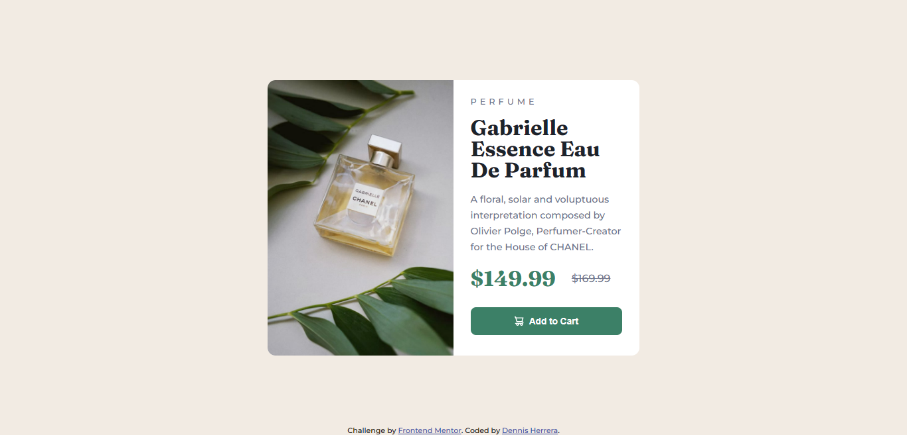
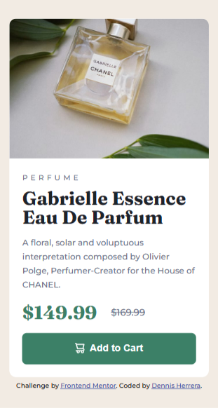

# Frontend Mentor - Product preview card component solution

This is a solution to the [Product preview card component challenge on Frontend Mentor](https://www.frontendmentor.io/challenges/product-preview-card-component-GO7UmttRfa). Frontend Mentor challenges help you improve your coding skills by building realistic projects. 

## Table of contents

- [Overview](#overview)
  - [The challenge](#the-challenge)
  - [Screenshot](#screenshot)
  - [Links](#links)
- [My process](#my-process)
  - [Built with](#built-with)
  - [What I learned](#what-i-learned)
  - [Continued development](#continued-development)
  - [Useful resources](#useful-resources)
- [Author](#author)

## Overview

### The challenge

Users should be able to:

- View the optimal layout depending on their device's screen size
- See hover and focus states for interactive elements

### Screenshot




### Links

- [Front end solution](https://www.frontendmentor.io/profile/Klonnister/solutions)
- [Live site](https://klonnister.github.io/Product-review/)

## My process

### Built with

- Semantic HTML5 markup
- CSS custom properties
- Flexbox
- Mobile-first workflow

### What I learned

In this exercise I learned to use the picture and source HTML tags which are used to display different images depending on the screen size. You can show a small version of your image in small screens and a larger or customized one for large screens. I also got familiar with the attributes srcset and media.

```html
<picture>
  <source media="(min-width: 36em)" srcset="images/">
  
</picture>
```

I also learned to use the ins and del tags, which are used to specify content that is no longer accurate and content that has been inserted.

```html
<ins>$149.99</ins>
<del>$169.99</del>
```

Regarding to CSS I practiced using variables, which are a little bit new to me.

```css
:root {
  --white: hsl(0, 0%, 100%);
  --dark-cyan: hsl(158, 36%, 37%);
  --cream: hsl(30, 38%, 92%);
}
```

I gotta be careful with adding a secondary font to be used by the browser in case the one imported is not working properly.

```css
p {
  font-family: 'Montserrat', sans-serif;
}
```

I just want to add a reminder of some properties so I can remember them easily.

```css
p {
  letter-spacing: 1rem;
  line-height: 2rem;
  vertical-align: middle;
}
```

### Continued development

Although for this exercise I didn't need to check documentation about variables and media queries, I'll keep working with them as they are the ones that I haven't memorized well and are very important.

```css
:root {
  --white: hsl(0, 0%, 100%);;
}

@media screen and (min-width: 375px) {
  .selector {
    display: none;
  }
}
```

### Useful resources

- [W3Schools HTML picture element](https://www.w3schools.com/html/html_images_picture.asp) - This helped me to understand how to use the picture, source and img elements and their attributes.

## Author

- Frontend Mentor - [Klonnister](https://www.frontendmentor.io/profile/Klonnister)
- Instagram - [dennis_herrera_f](https://www.instagram.com/dennis_herrera_f/)